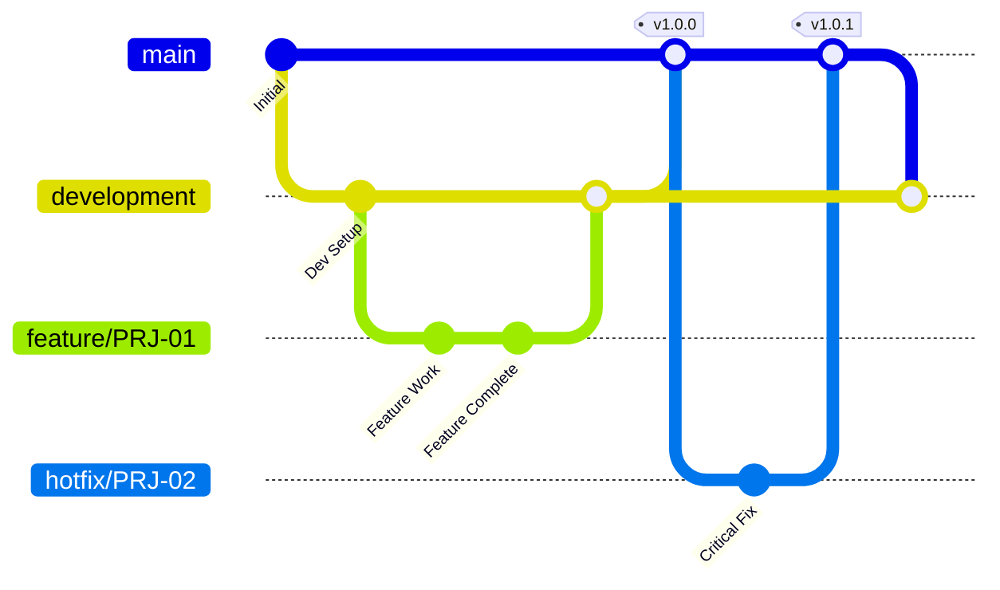

# 📘 Flutter Code Review Guidelines

> A comprehensive guide for maintaining code quality and consistency in Flutter projects.

---

## 📑 Table of Contents

1. [Branch Naming Convention](#-branch-naming-convention)
2. [Pull/Merge Request Guidelines](#-pullmerge-request-guidelines)
3. [Commit Message Guidelines](#-commit-message-guidelines)
4. [Naming Conventions](#-naming-conventions)

---

## 🌿 Branch Naming Convention

### Branch Structure Overview

Our repository follows a structured branching strategy to maintain code quality and streamline the development workflow.

```
                    ┌─────────────────┐
                    │      main       │  ← Production-ready code
                    └────────┬────────┘
                             │
                    ┌────────▼────────┐
                    │   development   │  ← Integration branch
                    └────────┬────────┘
                             │
              ┌──────────────┼──────────────┐
              │              │              │
     ┌────────▼────┐  ┌──────▼─────┐  ┌─────▼──────┐
     │  feature/*  │  │  hotfix/*  │  │  bugfix/*  │
     └─────────────┘  └────────────┘  └────────────┘
```

### Main Branches

| Branch | Purpose | Protected |
|--------|---------|:---------:|
| `main` | Production-ready code. Only receives merges from `development` after thorough testing. | ✅ |
| `development` | Integration branch for features. All feature branches merge here first. | ✅ |

### Supporting Branches

| Type | Pattern | Description | Example |
|------|---------|-------------|---------|
| 🚀 **Feature** | `feature/PRJ-XX` | New features or enhancements | `feature/PRJ-01` |
| 🔥 **Hotfix** | `hotfix/PRJ-XX` | Critical production fixes | `hotfix/PRJ-01` |
| 🐛 **Bugfix** | `bugfix/PRJ-XX` | Non-critical bug fixes | `bugfix/PRJ-01` |

### Naming Rules

| ✅ Do | ❌ Don't |
|-------|----------|
| `feature/PRJ-123` | `feature/new-feature` |
| `hotfix/PRJ-456` | `hotfix/fix-bug` |
| `feature/PRJ-01` | `Feature/PRJ-01` |
| Use lowercase | Use UPPERCASE or MixedCase |
| Reference ticket numbers | Use vague descriptions |

### Branch Workflow



### Quick Reference

> 💡 **Remember**: Always create branches from `development` for features and from `main` for hotfixes.

| Action | Command |
|--------|---------|
| Create feature branch | `git checkout -b feature/PRJ-XX development` |
| Create hotfix branch | `git checkout -b hotfix/PRJ-XX main` |
| Push branch | `git push -u origin feature/PRJ-XX` |

---

## 🔀 Pull/Merge Request Guidelines

### Overview

All code changes must go through a formal Pull Request (PR) / Merge Request (MR) process before being merged into protected branches.

```
┌──────────────┐     ┌──────────────┐     ┌──────────────┐     ┌──────────────┐
│   Create PR  │ ──▶ │ Code Review  │ ──▶ │  Run Tests   │ ──▶ │    Merge     │
│              │     │  (1 Reviewer)│     │  (CI/CD)     │     │              │
└──────────────┘     └──────────────┘     └──────────────┘     └──────────────┘
       │                    │                    │                    │
       ▼                    ▼                    ▼                    ▼
   📝 Draft PR         👀 Review           🧪 Unit Tests        ✅ Complete
   📋 Description      💬 Comments         🔄 Integration       🎉 Merged
   🏷️ Labels          ✏️ Changes          📊 Coverage          🗑️ Branch Deleted
```

### PR Requirements Checklist

| Requirement | Description | Mandatory |
|-------------|-------------|:---------:|
| 👤 **Reviewer** | Minimum **1 reviewer** must approve the PR | ✅ |
| 📝 **Description** | Clear description of changes and purpose | ✅ |
| 🔗 **Linked Issue** | Reference to related ticket (PRJ-XX) | ✅ |
| 🧪 **Unit Tests** | Tests must pass (project-dependent) | ⚙️ |
| 🔍 **Code Review** | All review comments must be resolved | ✅ |
| 🚫 **No Conflicts** | Branch must be up-to-date with target | ✅ |

### Review Process Flow

```
┌─────────────────────────────────────────────────────────────────────────────┐
│                           PR LIFECYCLE                                       │
├─────────────────────────────────────────────────────────────────────────────┤
│                                                                              │
│  1️⃣  DRAFT          2️⃣  READY           3️⃣  IN REVIEW      4️⃣  APPROVED     │
│  ┌─────────┐       ┌─────────┐        ┌─────────┐       ┌─────────┐        │
│  │ 📝 WIP  │  ──▶  │ 🔔 Open │   ──▶  │ 👀 Review│  ──▶  │ ✅ Ready │        │
│  └─────────┘       └─────────┘        └─────────┘       └─────────┘        │
│       │                 │                  │                  │             │
│       │                 │                  │                  ▼             │
│       │                 │                  │            ┌─────────┐        │
│       │                 │                  │            │ 🎯 Merge │        │
│       │                 │                  │            └─────────┘        │
│       │                 │                  │                               │
│   Work in             Request           Reviewer                           │
│   Progress            Review            Assigned                           │
│                                                                              │
└─────────────────────────────────────────────────────────────────────────────┘
```

### Reviewer Responsibilities

| Task | Description |
|------|-------------|
| 🔍 **Code Quality** | Check for clean, readable, and maintainable code |
| 🏗️ **Architecture** | Ensure changes align with project architecture |
| 🐛 **Bug Detection** | Identify potential bugs or edge cases |
| 📚 **Documentation** | Verify code is properly documented |
| 🧪 **Test Coverage** | Confirm adequate test coverage for changes |
| 🎨 **Style Guide** | Ensure code follows Flutter/Dart style guidelines |

### Unit Testing Requirements

> ⚙️ Unit test requirements are **project-dependent**. Configure based on your project's needs.

| Project Type | Test Requirement | Coverage Target |
|--------------|------------------|:---------------:|
| 🏢 **Enterprise** | Mandatory for all PRs | ≥ 80% |
| 📱 **Standard App** | Required for business logic | ≥ 60% |
| 🚀 **MVP/Prototype** | Recommended for critical paths | ≥ 40% |

#### CI/CD Pipeline Steps

```yaml
# Example CI Pipeline
stages:
  - analyze       # 🔍 Static analysis (flutter analyze)
  - test          # 🧪 Unit & Widget tests
  - build         # 🏗️ Build verification
  - coverage      # 📊 Coverage report (optional)
```

| Step | Command | Required |
|------|---------|:--------:|
| 🔍 Analyze | `flutter analyze` | ✅ |
| 🧪 Test | `flutter test` | ⚙️ Project-dependent |
| 📊 Coverage | `flutter test --coverage` | ⚙️ Project-dependent |
| 🏗️ Build | `flutter build` | ✅ |

### PR Title Format

| Type | Format | Example |
|------|--------|---------|
| 🚀 Feature | `[PRJ-XX] feat: description` | `[PRJ-01] feat: add user authentication` |
| 🐛 Bug Fix | `[PRJ-XX] fix: description` | `[PRJ-02] fix: resolve login crash` |
| 🔥 Hotfix | `[PRJ-XX] hotfix: description` | `[PRJ-03] hotfix: critical payment bug` |
| 🔧 Refactor | `[PRJ-XX] refactor: description` | `[PRJ-04] refactor: optimize api calls` |

### Merge Rules

| Target Branch | Source Branch | Approval Required | Tests Required |
|---------------|---------------|:-----------------:|:--------------:|
| `development` | `feature/*` | 1 Reviewer ✅ | ⚙️ Project-dependent |
| `development` | `bugfix/*` | 1 Reviewer ✅ | ⚙️ Project-dependent |
| `main` | `development` | 1 Reviewer ✅ | ✅ All tests must pass |
| `main` | `hotfix/*` | 1 Reviewer ✅ | ✅ All tests must pass |

### Best Practices

> 💡 **Tips for Effective PRs**

| ✅ Do | ❌ Don't |
|-------|----------|
| Keep PRs small and focused | Create massive PRs with unrelated changes |
| Write clear, descriptive titles | Use vague titles like "fixes" or "updates" |
| Respond to review comments promptly | Ignore or dismiss feedback |
| Self-review before requesting review | Submit without checking your own code |
| Update PR description if scope changes | Leave outdated descriptions |
| Delete branch after merge | Leave stale branches in repository |

---

## 📝 Commit Message Guidelines

### Overview

Commit messages are a critical part of project documentation. They help team members understand the history and purpose of changes. Well-written commit messages make debugging, reviewing, and collaboration much easier.

> 🌐 **Language**: Both **English** and **Turkish** are acceptable for commit messages.

### Commit Message Structure

```
<type>: <subject>

<body (optional but recommended)>

<footer (optional)>
```

```
┌─────────────────────────────────────────────────────────────────────┐
│                        COMMIT MESSAGE ANATOMY                        │
├─────────────────────────────────────────────────────────────────────┤
│                                                                      │
│   feat: Add user authentication with biometric support               │
│   ─────────────────────────────────────────────────────              │
│     │              │                                                 │
│     │              └─► Subject: Descriptive, explains WHAT & WHY     │
│     │                                                                │
│     └─► Type: Category of change                                     │
│                                                                      │
│   - Implemented fingerprint and face recognition login               │
│   - Added fallback to PIN code authentication                        │
│   - Updated security provider configuration                          │
│   ─────────────────────────────────────────────────────              │
│     │                                                                │
│     └─► Body: Detailed explanation (optional but recommended)        │
│                                                                      │
│   Closes #123                                                        │
│   ─────────────────────────────────────────────────────              │
│     │                                                                │
│     └─► Footer: References to issues/tickets (optional)              │
│                                                                      │
└─────────────────────────────────────────────────────────────────────┘
```

### Commit Types

| Type | Emoji | Description | Example |
|------|:-----:|-------------|---------|
| `feat` | ✨ | New feature or functionality | `feat: Add dark mode toggle` |
| `fix` | 🐛 | Bug fix | `fix: Resolve null pointer in user service` |
| `docs` | 📚 | Documentation changes | `docs: Update API documentation` |
| `style` | 💄 | Code style (formatting, semicolons, etc.) | `style: Format code with dart formatter` |
| `refactor` | ♻️ | Code refactoring (no feature/fix) | `refactor: Simplify authentication logic` |
| `test` | 🧪 | Adding or modifying tests | `test: Add unit tests for cart service` |
| `chore` | 🔧 | Build process or auxiliary tool changes | `chore: Update dependencies` |
| `perf` | ⚡ | Performance improvements | `perf: Optimize image loading` |
| `ci` | 👷 | CI/CD configuration changes | `ci: Add Flutter analyze step` |

### Message Length Requirements

| Part | Minimum | Maximum | Required |
|------|:-------:|:-------:|:--------:|
| **Subject** | 15 characters | 72 characters | ✅ |
| **Body** | - | - | 📋 Recommended |
| **Footer** | - | - | ⚙️ Optional |

> ⚠️ **Important**: Commit messages that are too short or vague will be **rejected** during code review.

### Good vs Bad Examples

#### ❌ Bad Commit Messages (TOO SHORT / VAGUE)

| Bad Message | Problem |
|-------------|---------|
| `fix` | No description at all |
| `update` | What was updated? |
| `changes` | What changes? |
| `bug fix` | Which bug? Where? |
| `wip` | Work in progress is not a valid commit |
| `asdf` | Meaningless |
| `done` | What is done? |
| `test` | What test? |

#### ✅ Good Commit Messages (DESCRIPTIVE)

**English Examples:**

```
feat: Add biometric authentication for secure login

- Implemented fingerprint recognition using local_auth package
- Added FaceID support for iOS devices
- Created fallback mechanism for devices without biometric support
- Updated user preferences to store biometric settings

Closes PRJ-123
```

```
fix: Resolve crash when navigating back from payment screen

The app was crashing due to disposed controller being accessed
after the widget was removed from the tree. Added proper lifecycle
management and null checks to prevent this issue.

Fixes PRJ-456
```

```
refactor: Simplify state management in product listing

- Migrated from StatefulWidget to Riverpod providers
- Reduced widget rebuilds by 40%
- Extracted business logic into separate service class
```

**Turkish Examples (Türkçe Örnekler):**

```
feat: Kullanıcı profil sayfasına fotoğraf yükleme özelliği eklendi

- Galeriden ve kameradan fotoğraf seçimi implementasyonu yapıldı
- Fotoğraf sıkıştırma ve boyutlandırma işlemleri eklendi
- Firebase Storage entegrasyonu tamamlandı

PRJ-789
```

```
fix: Sepet sayfasında ürün silme işlemindeki hata giderildi

Ürün silindiğinde toplam fiyat güncellenmiyordu. State yönetimi
düzeltilerek anlık güncelleme sağlandı.

PRJ-321
```

### Commit Message Rules

| Rule | ✅ Do | ❌ Don't |
|------|-------|----------|
| **Be Descriptive** | `feat: Add user profile photo upload with cropping` | `feat: photo` |
| **Explain Why** | `fix: Prevent memory leak by disposing animation controller` | `fix: memory` |
| **Use Present Tense** | `Add feature` / `Fix bug` | `Added feature` / `Fixed bug` |
| **Capitalize First Letter** | `feat: Add new button` | `feat: add new button` |
| **No Period at End** | `feat: Add login screen` | `feat: Add login screen.` |
| **Reference Tickets** | `Closes PRJ-123` | No reference to related work |
| **One Logical Change** | One commit per logical change | Multiple unrelated changes |

### Minimum Information Checklist

Every commit message should answer these questions:

| Question | Required |
|----------|:--------:|
| 📌 **WHAT** was changed? | ✅ |
| 🤔 **WHY** was it changed? | ✅ |
| 🔗 **WHICH** ticket/issue is related? | 📋 Recommended |
| ⚠️ **IMPACT** - Does it break anything? | ⚙️ If applicable |

### Quick Reference Card

```
┌─────────────────────────────────────────────────────────────┐
│                  COMMIT MESSAGE CHECKLIST                    │
├─────────────────────────────────────────────────────────────┤
│                                                              │
│  ☐ Type prefix used (feat/fix/docs/style/refactor/test)     │
│  ☐ Subject is descriptive (minimum 15 characters)           │
│  ☐ Explains WHAT was changed                                 │
│  ☐ Explains WHY it was changed                               │
│  ☐ References related ticket (PRJ-XX)                        │
│  ☐ Written in present tense                                  │
│  ☐ First letter capitalized                                  │
│  ☐ No period at the end of subject                          │
│  ☐ Body added for complex changes                            │
│                                                              │
└─────────────────────────────────────────────────────────────┘
```

---

## 🏷️ Naming Conventions

### Overview

Consistent naming conventions are essential for code readability and maintainability. This section covers Dart and Flutter specific naming rules that every team member must follow.

```
┌─────────────────────────────────────────────────────────────────────┐
│                    DART NAMING CONVENTIONS OVERVIEW                  │
├─────────────────────────────────────────────────────────────────────┤
│                                                                      │
│   PascalCase     →  Classes, Enums, Typedefs, Extensions            │
│   camelCase      →  Variables, Functions, Parameters                 │
│   snake_case     →  Files, Folders, Packages, Libraries             │
│   _prefixed      →  Private members                                  │
│   SCREAMING_CASE →  Compile-time constants (optional)               │
│                                                                      │
└─────────────────────────────────────────────────────────────────────┘
```

### Naming Styles Reference

| Style | Usage | Example |
|-------|-------|---------|
| `PascalCase` | Classes, Enums, Typedefs, Extensions, Mixins | `UserProfile`, `AuthState` |
| `camelCase` | Variables, Functions, Methods, Parameters | `userName`, `fetchData()` |
| `snake_case` | Files, Directories, Packages, Libraries | `user_profile.dart` |
| `_camelCase` | Private members | `_privateMethod()`, `_counter` |
| `SCREAMING_SNAKE_CASE` | Compile-time constants (optional) | `MAX_RETRY_COUNT` |

---

### 📁 Files & Directories

> All file and directory names should use `snake_case`

| Type | Convention | ✅ Good | ❌ Bad |
|------|------------|---------|--------|
| Dart files | `snake_case.dart` | `user_profile.dart` | `UserProfile.dart`, `userProfile.dart` |
| Directories | `snake_case` | `user_management/` | `UserManagement/`, `userManagement/` |
| Test files | `*_test.dart` | `user_service_test.dart` | `UserServiceTest.dart` |
| Generated files | `*.g.dart`, `*.freezed.dart` | `user.g.dart` | `User.g.dart` |

#### Flutter Project Structure Example

```
lib/
├── core/
│   ├── constants/
│   │   ├── app_colors.dart         ✅ snake_case
│   │   ├── app_strings.dart        ✅ snake_case
│   │   └── api_endpoints.dart      ✅ snake_case
│   ├── utils/
│   │   ├── date_formatter.dart     ✅ snake_case
│   │   └── validators.dart         ✅ snake_case
│   └── extensions/
│       ├── string_extensions.dart  ✅ snake_case
│       └── context_extensions.dart ✅ snake_case
├── features/
│   └── authentication/
│       ├── data/
│       │   ├── models/
│       │   │   └── user_model.dart         ✅ snake_case
│       │   └── repositories/
│       │       └── auth_repository.dart    ✅ snake_case
│       ├── domain/
│       │   └── entities/
│       │       └── user_entity.dart        ✅ snake_case
│       └── presentation/
│           ├── screens/
│           │   └── login_screen.dart       ✅ snake_case
│           ├── widgets/
│           │   └── login_form.dart         ✅ snake_case
│           └── providers/
│               └── auth_provider.dart      ✅ snake_case
└── main.dart
```

---

### 📦 Classes

> Use `PascalCase` for all class names

```dart
// ✅ GOOD - PascalCase
class UserProfile {}
class AuthenticationService {}
class ShoppingCartItem {}
class HttpClientException {}

// ❌ BAD
class userProfile {}        // camelCase - wrong
class User_Profile {}       // snake_case - wrong
class USERPROFILE {}        // UPPERCASE - wrong
class Userprofile {}        // Not properly capitalized
```

#### Widget Classes

```dart
// ✅ GOOD - Descriptive widget names with suffix
class LoginScreen extends StatefulWidget {}
class UserProfileCard extends StatelessWidget {}
class CustomElevatedButton extends StatelessWidget {}
class ProductListTile extends StatelessWidget {}
class ShimmerLoadingWidget extends StatelessWidget {}

// ❌ BAD - Vague or improper names
class Login extends StatefulWidget {}         // Too vague
class Card1 extends StatelessWidget {}        // Numbered names
class MyWidget extends StatelessWidget {}     // Non-descriptive
class userCard extends StatelessWidget {}     // camelCase
```

#### Model Classes

```dart
// ✅ GOOD - Clear model naming
class UserModel {
  final String id;
  final String firstName;
  final String lastName;
  final String emailAddress;
  final DateTime createdAt;
  
  const UserModel({
    required this.id,
    required this.firstName,
    required this.lastName,
    required this.emailAddress,
    required this.createdAt,
  });
}

class ProductResponseDto {
  final List<ProductModel> products;
  final PaginationMeta meta;
  
  const ProductResponseDto({
    required this.products,
    required this.meta,
  });
}

// ❌ BAD
class User_Model {}          // snake_case
class usermodel {}           // lowercase
class UserDTO {}             // Abbreviation should be 'Dto'
```

---

### 🔤 Variables & Properties

> Use `camelCase` for all variables and properties

```dart
// ✅ GOOD - Descriptive camelCase
String userName = 'John';
int itemCount = 0;
bool isLoggedIn = false;
double totalPrice = 99.99;
List<String> selectedItems = [];
Map<String, dynamic> userPreferences = {};

// ✅ GOOD - Boolean naming (use is/has/can/should prefix)
bool isVisible = true;
bool hasPermission = false;
bool canEdit = true;
bool shouldRefresh = false;
bool isLoadingData = false;

// ❌ BAD
String UserName = 'John';       // PascalCase
int item_count = 0;             // snake_case
bool logged_in = false;         // snake_case
String s = 'John';              // Too short, non-descriptive
int x = 0;                      // Single letter variable
bool flag = true;               // Vague boolean name
```

#### Private Members

```dart
class UserService {
  // ✅ GOOD - Private members with underscore prefix
  final String _apiKey;
  int _retryCount = 0;
  bool _isInitialized = false;
  final List<String> _cachedUsers = [];
  
  // ✅ GOOD - Private methods
  void _initializeService() {}
  Future<void> _fetchFromCache() async {}
  bool _validateInput(String input) => input.isNotEmpty;
  
  // ❌ BAD
  String __apiKey;              // Double underscore
  int privateCount = 0;         // Missing underscore for private
}
```

---

### ⚡ Functions & Methods

> Use `camelCase` for all functions and methods

```dart
// ✅ GOOD - Verb-based, descriptive names
Future<User> fetchUserById(String userId) async {}
void updateUserProfile(UserProfile profile) {}
bool validateEmailAddress(String email) {}
List<Product> filterProductsByCategory(String category) {}
String formatCurrencyValue(double amount) {}
Future<void> saveToLocalStorage(String key, dynamic value) async {}

// ✅ GOOD - Async methods with clear intent
Future<List<Order>> loadUserOrders() async {}
Future<void> syncDataWithServer() async {}
Future<bool> checkNetworkConnectivity() async {}

// ✅ GOOD - Boolean returning methods
bool isValidPhoneNumber(String phone) {}
bool hasRequiredPermissions() {}
bool canUserAccessFeature(String featureId) {}

// ❌ BAD
void DoSomething() {}           // PascalCase
void fetch_user() {}            // snake_case
void f() {}                     // Too short
void data() {}                  // Noun instead of verb
void process() {}               // Too vague
Future<void> user() async {}    // Noun, unclear intent
```

#### Getters & Setters

```dart
class ShoppingCart {
  final List<CartItem> _items = [];
  
  // ✅ GOOD - Descriptive getters
  int get itemCount => _items.length;
  double get totalPrice => _items.fold(0, (sum, item) => sum + item.price);
  bool get isEmpty => _items.isEmpty;
  bool get hasDiscountApplied => _discountCode != null;
  List<CartItem> get items => List.unmodifiable(_items);
  
  String? _discountCode;
  
  // ✅ GOOD - Setters with validation
  set discountCode(String? code) {
    if (code == null || code.length >= 4) {
      _discountCode = code;
    }
  }
  
  // ❌ BAD
  int get GetCount => _items.length;  // PascalCase getter
  int get cnt => _items.length;       // Abbreviated
}
```

---

### 📋 Enums

> Use `PascalCase` for enum names and `camelCase` for values

```dart
// ✅ GOOD - PascalCase enum, camelCase values
enum UserRole {
  admin,
  moderator,
  editor,
  viewer,
  guest,
}

enum OrderStatus {
  pending,
  processing,
  shipped,
  delivered,
  cancelled,
  refunded,
}

enum AuthenticationState {
  initial,
  loading,
  authenticated,
  unauthenticated,
  error,
}

// ✅ GOOD - Enhanced enums with properties
enum PaymentMethod {
  creditCard('Credit Card', Icons.credit_card),
  debitCard('Debit Card', Icons.payment),
  bankTransfer('Bank Transfer', Icons.account_balance),
  digitalWallet('Digital Wallet', Icons.wallet);
  
  final String displayName;
  final IconData icon;
  
  const PaymentMethod(this.displayName, this.icon);
}

// ❌ BAD
enum user_role { Admin, Moderator }   // snake_case enum, PascalCase values
enum ORDERSTATUS { PENDING }          // SCREAMING_CASE
enum orderStatus { Pending }          // camelCase enum
```

---

### 🔒 Constants

> Use `camelCase` for constants (Dart style guide recommendation)

```dart
// ✅ GOOD - Dart recommended style (camelCase)
const int maxRetryAttempts = 3;
const double defaultPadding = 16.0;
const String apiBaseUrl = 'https://api.example.com';
const Duration connectionTimeout = Duration(seconds: 30);

// ✅ GOOD - Constant class/group
class AppConstants {
  AppConstants._(); // Private constructor
  
  static const int maxImageSize = 5 * 1024 * 1024; // 5MB
  static const int maxUsernameLength = 30;
  static const int minPasswordLength = 8;
  static const String defaultLocale = 'en_US';
}

class ApiEndpoints {
  ApiEndpoints._();
  
  static const String baseUrl = 'https://api.example.com/v1';
  static const String users = '$baseUrl/users';
  static const String products = '$baseUrl/products';
  static const String orders = '$baseUrl/orders';
}

// ✅ ACCEPTABLE - SCREAMING_SNAKE_CASE for compile-time constants
// (Some teams prefer this for better visibility)
const int MAX_RETRY_ATTEMPTS = 3;
const String API_BASE_URL = 'https://api.example.com';

// ❌ BAD
const int MaxRetryAttempts = 3;   // PascalCase
const int max_retry = 3;          // snake_case with abbreviation
```

#### Theme Constants

```dart
// ✅ GOOD - Organized color constants
class AppColors {
  AppColors._();
  
  // Primary colors
  static const Color primaryBlue = Color(0xFF2196F3);
  static const Color primaryDark = Color(0xFF1976D2);
  static const Color primaryLight = Color(0xFFBBDEFB);
  
  // Semantic colors
  static const Color successGreen = Color(0xFF4CAF50);
  static const Color errorRed = Color(0xFFF44336);
  static const Color warningOrange = Color(0xFFFF9800);
  static const Color infoBlue = Color(0xFF2196F3);
  
  // Neutral colors
  static const Color textPrimary = Color(0xFF212121);
  static const Color textSecondary = Color(0xFF757575);
  static const Color backgroundLight = Color(0xFFFAFAFA);
  static const Color dividerColor = Color(0xFFBDBDBD);
}

class AppTextStyles {
  AppTextStyles._();
  
  static const TextStyle headlineLarge = TextStyle(
    fontSize: 32,
    fontWeight: FontWeight.bold,
    letterSpacing: -0.5,
  );
  
  static const TextStyle bodyMedium = TextStyle(
    fontSize: 14,
    fontWeight: FontWeight.normal,
    height: 1.5,
  );
}
```

---

### 🧩 Extensions

> Use `PascalCase` with descriptive suffix

```dart
// ✅ GOOD - Clear extension naming
extension StringExtensions on String {
  bool get isValidEmail {
    return RegExp(r'^[\w-\.]+@([\w-]+\.)+[\w-]{2,4}$').hasMatch(this);
  }
  
  String get capitalizeFirst {
    if (isEmpty) return this;
    return '${this[0].toUpperCase()}${substring(1)}';
  }
  
  String truncate(int maxLength) {
    if (length <= maxLength) return this;
    return '${substring(0, maxLength)}...';
  }
}

extension DateTimeExtensions on DateTime {
  String get formattedDate => '$day/$month/$year';
  
  String get timeAgo {
    final difference = DateTime.now().difference(this);
    if (difference.inDays > 0) return '${difference.inDays}d ago';
    if (difference.inHours > 0) return '${difference.inHours}h ago';
    return '${difference.inMinutes}m ago';
  }
  
  bool get isToday {
    final now = DateTime.now();
    return year == now.year && month == now.month && day == now.day;
  }
}

extension BuildContextExtensions on BuildContext {
  ThemeData get theme => Theme.of(this);
  TextTheme get textTheme => Theme.of(this).textTheme;
  ColorScheme get colorScheme => Theme.of(this).colorScheme;
  Size get screenSize => MediaQuery.of(this).size;
  
  void showSnackBar(String message) {
    ScaffoldMessenger.of(this).showSnackBar(
      SnackBar(content: Text(message)),
    );
  }
}

// ❌ BAD
extension Strings on String {}       // Too vague
extension string_ext on String {}    // snake_case
extension on String {}               // Anonymous extension (hard to reference)
```

---

### 🎛️ Typedef & Type Aliases

> Use `PascalCase` for type definitions

```dart
// ✅ GOOD - Clear type aliases
typedef JsonMap = Map<String, dynamic>;
typedef VoidCallback = void Function();
typedef ValueChanged<T> = void Function(T value);
typedef AsyncValueGetter<T> = Future<T> Function();
typedef ItemBuilder<T> = Widget Function(BuildContext context, T item);

// ✅ GOOD - Function type definitions
typedef OnUserSelected = void Function(User user);
typedef OnError = void Function(String errorMessage);
typedef DataFetcher<T> = Future<T> Function(String id);
typedef Validator = String? Function(String? value);

// Usage example
class UserListWidget extends StatelessWidget {
  final OnUserSelected onUserSelected;
  final ItemBuilder<User> itemBuilder;
  
  const UserListWidget({
    required this.onUserSelected,
    required this.itemBuilder,
  });
}

// ❌ BAD
typedef json_map = Map<String, dynamic>;  // snake_case
typedef callback = void Function();        // camelCase
```

---

### 📊 Complete Naming Convention Summary

| Element | Convention | Example |
|---------|------------|---------|
| **Classes** | `PascalCase` | `UserProfileService` |
| **Widgets** | `PascalCase` + Suffix | `LoginScreen`, `CustomButton` |
| **Enums** | `PascalCase` | `AuthState` |
| **Enum Values** | `camelCase` | `authenticated`, `loading` |
| **Variables** | `camelCase` | `userName`, `isLoading` |
| **Constants** | `camelCase` or `SCREAMING_CASE` | `maxRetry`, `MAX_RETRY` |
| **Functions** | `camelCase` | `fetchUserData()` |
| **Methods** | `camelCase` | `calculateTotal()` |
| **Parameters** | `camelCase` | `userId`, `onPressed` |
| **Private Members** | `_camelCase` | `_controller`, `_init()` |
| **Files** | `snake_case` | `user_service.dart` |
| **Directories** | `snake_case` | `data_sources/` |
| **Packages** | `snake_case` | `flutter_bloc` |
| **Extensions** | `PascalCase` + Extension | `StringExtensions` |
| **Typedefs** | `PascalCase` | `JsonMap`, `VoidCallback` |
| **Mixins** | `PascalCase` | `ValidationMixin` |

### Quick Reference Card

```
┌────────────────────────────────────────────────────────────────────────┐
│                    DART/FLUTTER NAMING CHECKLIST                        │
├────────────────────────────────────────────────────────────────────────┤
│                                                                         │
│  📁 FILES & FOLDERS                                                     │
│     ☐ All files use snake_case.dart                                     │
│     ☐ All directories use snake_case                                    │
│     ☐ Test files end with _test.dart                                    │
│                                                                         │
│  📦 CLASSES & TYPES                                                     │
│     ☐ Classes use PascalCase                                            │
│     ☐ Enums use PascalCase with camelCase values                        │
│     ☐ Extensions use PascalCase with descriptive suffix                 │
│     ☐ Typedefs use PascalCase                                           │
│                                                                         │
│  🔤 VARIABLES & FUNCTIONS                                               │
│     ☐ Variables use camelCase                                           │
│     ☐ Functions/Methods use camelCase                                   │
│     ☐ Booleans have is/has/can/should prefix                           │
│     ☐ Private members have _ prefix                                     │
│                                                                         │
│  📋 GENERAL RULES                                                       │
│     ☐ Names are descriptive and meaningful                              │
│     ☐ No single-letter variables (except loops: i, j, k)               │
│     ☐ No abbreviations unless widely known (id, url, api)               │
│     ☐ Functions start with verbs (get, set, fetch, load)               │
│                                                                         │
└────────────────────────────────────────────────────────────────────────┘
```

---
